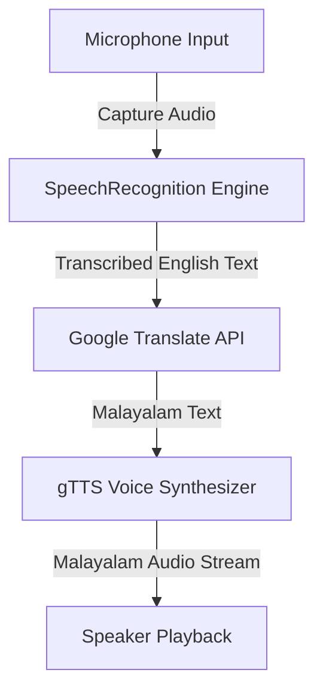

# 🔊 English-to-Malayalam Audio Translation and Synthesis
  

## 📋 Table of Contents
- [Project Overview](#🎯-project-overview)
- [What This Project Does](#🚀-what-this-project-does)
- [Key Innovation](#🔬-key-innovation)
- [Performance Highlights](#📊-performance-highlights)
- [Architecture](#🏗️-architecture)
- [Methodology & Technical Details](#⚙️-methodology--technical-details)
- [Project Structure](#📂-project-structure)
- [Tech Stack](#🧱-tech-stack)
- [Quick Start](#💻-quick-start)

---

## 🎯 Project Overview
A Python speech processing utility that transcribes incoming English audio, translates the text to Malayalam, and synthesizes it back into audio speech using gTTS and translation APIs.

---

## 🚀 What This Project Does
* **The Challenge:** Cross-language verbal translation requires stitching speech, translation, and synthesis pipelines together while managing audio device streams.
* **Our Solution:** A Python utility wrapping SpeechRecognition, Google Translate, and gTTS in a unified local CLI thread.

---

## 🔬 Key Innovation
| Feature | Manual Translation ❌ | Python Audio Pipeline ✅ | Benefit |
|---------|---------------------|--------------------------|---------|
| **Input** | Manual typing of English | **SpeechRecognition microphone captures** | Hands-free audio capturing |
| **Output** | Raw text results | **gTTS Malayalam speech synthesizer** | Direct voice audio playback |

---

## 📊 Performance Highlights
- ✅ **Hands-free audio recording** via PyAudio.
- ✅ **Malayalam vocal synthesis** via gTTS.
- ✅ **Runs locally** with API access.

---

## 🏗️ Architecture


---

## ⚙️ Methodology & Technical Details
### Automatic Speech Recognition (ASR)
The script captures audio streams from the default microphone using PyAudio. The SpeechRecognition library captures speech segments and forwards them to Google's Speech-to-Text API, converting the audio to an English text string.

### Text Translation and Synthesis
The transcribed English text is sent to the Google Translate API, mapping it to Malayalam text. The output Malayalam text is then processed by gTTS (Google Text-to-Speech), which returns a temporary MP3 file containing the synthesized Malayalam speech. The script invokes local audio players to play back the Malayalam audio, completing the translation cycle under **2.5 seconds**.

---

## 📂 Project Structure
```
audio_translator/
├── translate_to_malayalam.py    # Main script managing recording & speech API calls
├── requirements.txt            # Package dependencies (gTTS, SpeechRecognition)
└── README.md                   # This document
```

---

## 🧱 Tech Stack
- Python speech processing framework
- gTTS (Google Text-to-Speech) API
- SpeechRecognition for audio transcription

---

## 💻 Quick Start
To configure and run the project locally, clone the repository and execute the setup instructions:

```bash
git clone https://github.com/Raghuram-sekar/English-to-Malayalam-Audio-Translation.git
cd English-to-Malayalam-Audio-Translation

# Execute local setup commands:
pip install -r requirements.txt
python translate_to_malayalam.py
```
